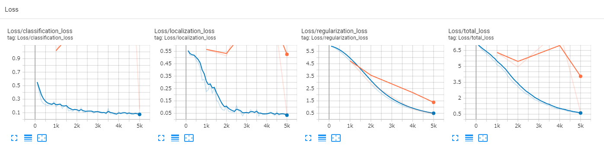

Synthetic datageneration for machine learning models with Suzanne / monkey.

Model training is done based on the procedure of [this article](https://blog.tensorflow.org/2021/01/custom-object-detection-in-browser.html).


Input image is like this. The dataset has variety of monkey images with different position, rotation and color.


How detection precision changed through the training process.


How losses changed through the training process. After 4k steps, eval loss is dynamically reduced.


Other metrics can be checked on [this page](https://tensorboard.dev/experiment/iQx5DYVERuG3MTaD2IdRdg/#scalars).


# Training / Checking result

1. Open the Blender file and run the script and generate the dataset.
2. Create the `dataset` directory and copy the generated images to it. (Check `sample_dataset` directory.)
3. Run the following commands.
```
python dataset/generate_tf_records.py -l labelmap.pbtxt -o dataset/train.record -i dataset/images -csv dataset/train_labels.csv
python dataset/generate_tf_records.py -l labelmap.pbtxt -o dataset/test.record -i dataset/images -csv dataset/test_labels.csv
python models/research/object_detection/model_main_tf2.py --pipeline_config_path=mobilenet_v2.config --model_dir=training/ --alsologtostderr --num_train_steps=5000 --sample_1_of_n_eval_examples=1 --num_eval_steps=500
python models/research/object_detection/model_main_tf2.py --pipeline_config_path=mobilenet_v2.config --model_dir=training/ --checkpoint_dir=training
python models/research/object_detection/exporter_main_v2.py --trained_checkpoint_dir=training/ --output_directory=inference_graph/ --pipeline_config_path mobilenet_v2.config
tensorflowjs_converter --input_format=tf_saved_model --output_format=tfjs_graph_model inference_graph/saved_model/ tfjs_model
```
4. Move generated `tfjs_model` to `web/model` directory.
5. Start a HTTP server in `web/` directory.